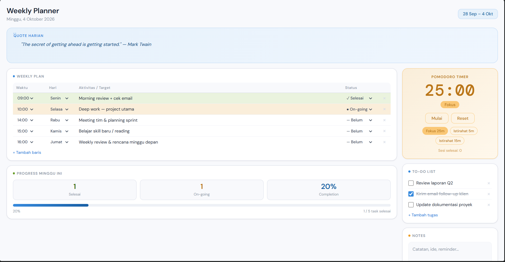
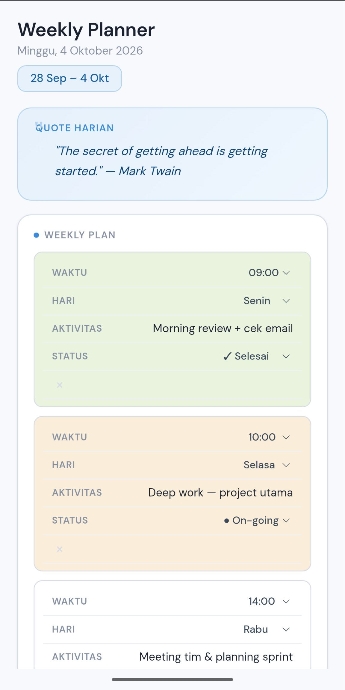

# Weekly Planner

A weekly planner web app — plan your week, track a to-do list, jot notes, and stay focused with a built-in Pomodoro timer. Built with PHP and MySQL, containerized with Docker, deployed behind Nginx and Tailscale Funnel.

## Tech Stack
- PHP 8.2 (Apache)
- MySQL 8.0
- Vanilla JS (no framework)
- Docker & Docker Compose
- Nginx (reverse proxy)
- Tailscale Funnel (public HTTPS access)

## Features
- **Weekly Plan table** — schedule activities by day and time, track status (pending/on-going/done)
- **Progress tracker** — visual completion stats for the week
- **To-do list** — quick task checklist
- **Notes** — freeform notes area
- **Daily quote** — a motivational quote card
- **Pomodoro timer** — focus/break session timer

## Screenshots



## Credits

UI/UX design based on [weekly-planner](https://github.com/ressaudy/weekly-planner) by [ressaudy](https://github.com/ressaudy).

## Running Locally

1. Clone this repo
2. Copy `.env.example` to `.env` and fill in a database password:
```bash
   cp .env.example .env
```
3. Build and run:
```bash
   docker compose up -d --build
```
4. Access at `http://localhost:8080`

## Project Structure
- `index.php` — main page markup
- `app.js` — frontend logic (weekly table, todos, notes, pomodoro)
- `style.css` — styling
- `config.php` — database connection
- `sql/init.sql` — database schema
- `Dockerfile` — PHP + Apache container definition
- `docker-compose.yml` — multi-container orchestration (web + db)
- `legacy/` — reference files from the previous simple to-do list version (not deployed)

## API Endpoints
- `GET/POST/DELETE /api/weekly.php` — weekly plan rows
- `GET/POST/DELETE /api/todos.php` — to-do list items
- `GET/POST /api/settings.php` — quote & notes (key-value)

## Status
Fully migrated to MySQL-backed persistence. All data (weekly plan, to-do list, notes, quote) syncs across devices. Pomodoro timer remains session-only (client-side), by design.
